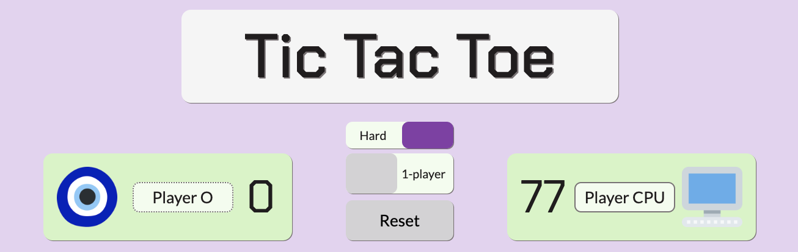
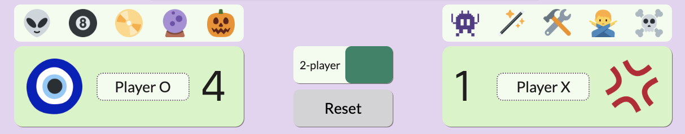

# tic-tac-toe
[Tic Tac Toe](https://github.com/dwgrossberg/tic-tac-toe) is a single-page game app that allows users to play their friends (2-player mode) or the computer (1-player mode).

This game was written in vanilla JavaScript built as part of the open-source Odin Project curriculum. 

## Highlights
- 1-player mode features two AI bots: an Easy CPU based on a simple `randomMove` function and an unbeatable Hard CPU based on a custom-built `smartishCPU` function

- Ability to customize player names and icons for both 1-player and 2-player modes

- The gameboard highlights the first winning combination and sets the `backgroundImage` of the container to match the winning player's game piece

## Learning Outcomes
- Strengthened understanding of using factory functions to create closure and write private functions
- Utilized module design patterns to minimize the amount of global code within the overall program
- Gained a deeper understanding of several common array methods: filter, reduce, and map
- Developed an unbeatable AI bot for 1-player mode